# Customer Churn Prediction — Feature Selection × Oversampling × Classifier Pipeline


A large-scale benchmarking study that evaluates **1,000 machine learning pipeline configurations** — 10 feature selection methods × 10 oversampling techniques × 10 classifiers — to find the best-performing approach for predicting customer churn on the Telco Customer Churn dataset.

---

## Problem Statement

Customer churn — when a subscriber stops using a service — is one of the costliest problems in telecom. Retaining an existing customer is far cheaper than acquiring a new one, so being able to flag at-risk customers early has direct business value.

The Telco Customer Churn dataset reflects a typical real-world challenge: **class imbalance**. Only ~26.5% of customers churn, which biases naive models toward always predicting "no churn." This project systematically tests whether combining feature selection, oversampling, and hyperparameter tuning can meaningfully lift predictive performance — and which combination works best.

---

## Dataset

**Telco Customer Churn** (IBM Sample Dataset, via Kaggle)

| Property | Value |
|---|---|
| Rows (after cleaning) | 7,010 |
| Features | 19 predictors + target |
| Target | `Churn` (Yes/No) |
| Class balance | 73.5% No-Churn / 26.5% Churn (5,153 vs 1,857) |

Feature types include binary categoricals (Partner, Dependents, PhoneService, PaperlessBilling), multi-class categoricals (Contract, InternetService, PaymentMethod), and numerics (tenure, MonthlyCharges, TotalCharges).

---

## Exploratory Data Analysis

A few patterns stood out before any modeling began:

**Contract type is the strongest churn signal.** Month-to-month customers churn at **42.6%**, versus 11.3% for one-year and just **2.8%** for two-year contracts.

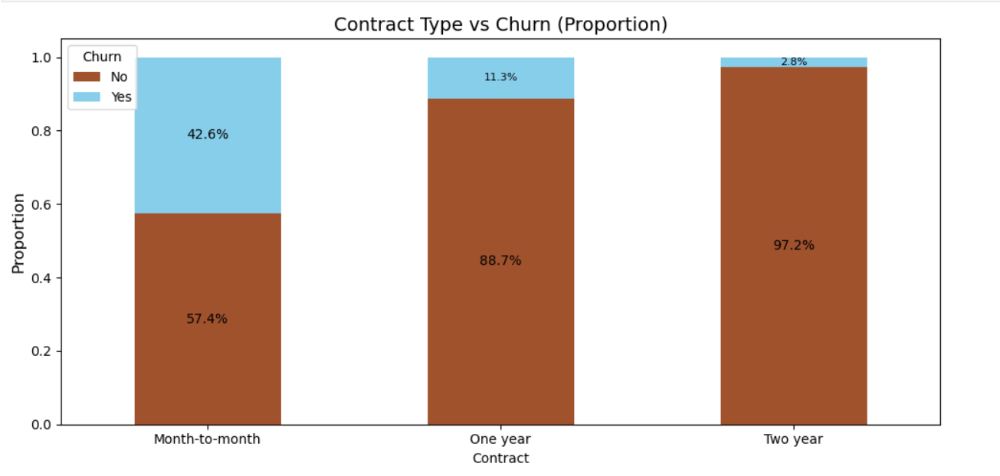

**Tenure tells the same story from a different angle.** Customers who stayed have a median tenure of **38 months**; those who left had a median of just **10 months**.

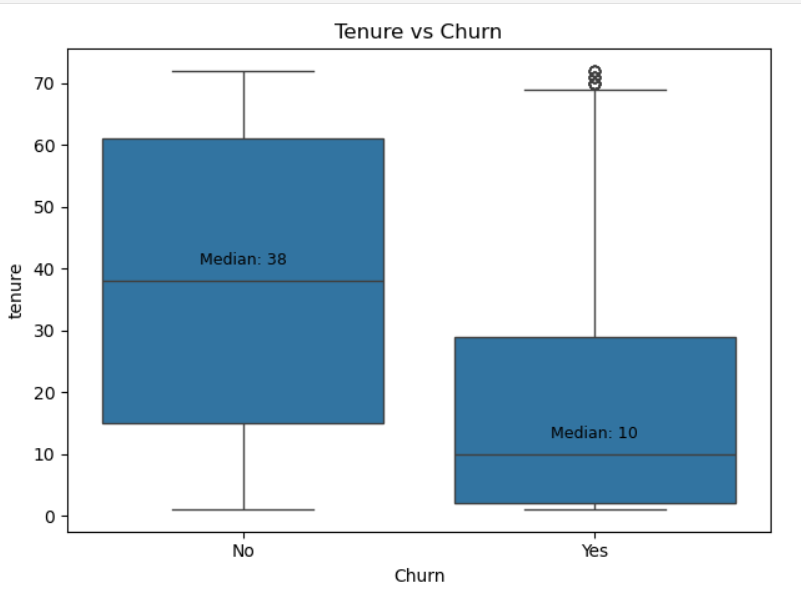

**Payment method matters.** Electronic check users churn at **45.1%**, more than double the rate of automatic bank transfer (16.7%) or credit card (15.3%) users — convenience and automation correlate with retention.

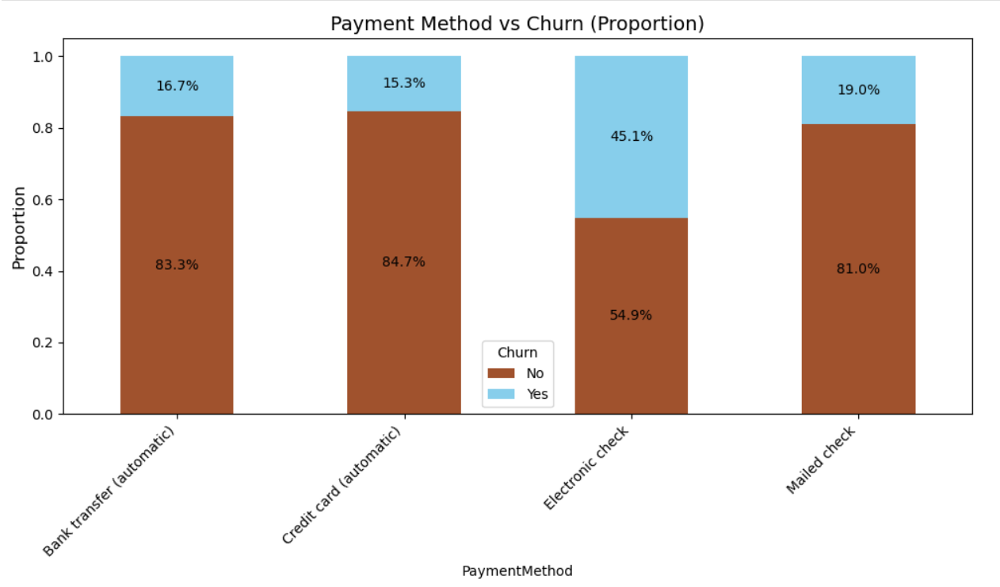

**Family status correlates with retention.** Customers without a partner churn far more (1,188 vs 669), and customers without dependents churn far more (1,531 vs 326).

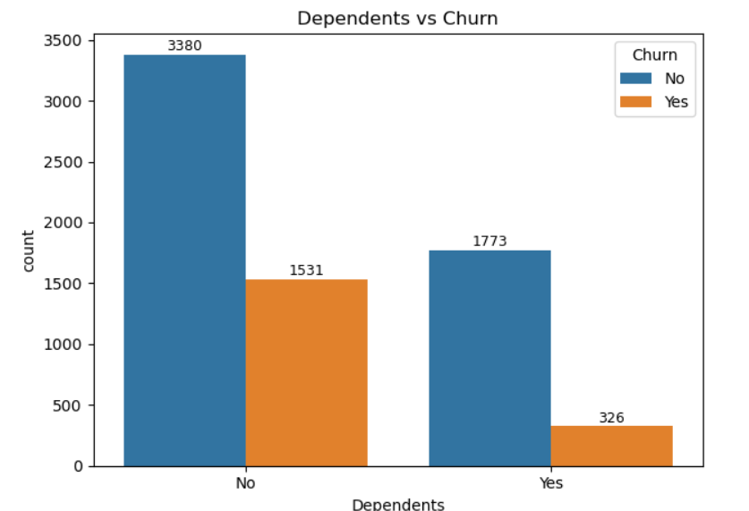

**Gender showed no meaningful difference** in churn rate (934 vs 923 churned customers for female/male respectively), confirming it's a weak predictor on its own.

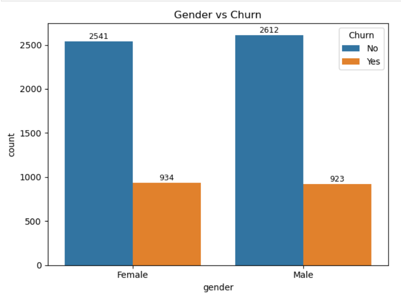

**Class imbalance is the central challenge** this pipeline addresses — roughly 3 non-churners for every churner.

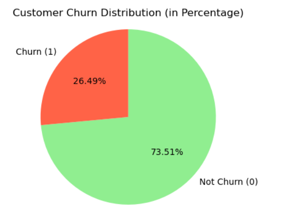

---

## Methodology

### 1. Preprocessing
- Dropped `customerID` (no predictive value)
- Converted `TotalCharges` from text to numeric, dropped rows with resulting nulls
- Removed duplicate rows
- Binary categoricals label-encoded (0/1); multi-class categoricals one-hot encoded
- `StandardScaler` for most pipelines; `MinMaxScaler` specifically for Chi²-based selection (which requires non-negative inputs)
- All scaling/encoding steps wrapped inside the pipeline to prevent data leakage during cross-validation

### 2. Feature Selection (10 methods)
Filter-based univariate selectors evaluating each feature's relationship to `Churn`:
- `SelectKBest` with ANOVA F-value, Chi², and Mutual Information
- `GenericUnivariateSelect` (F-value and Mutual Information scoring)
- `SelectPercentile` (F-value)
- `SelectFpr` (False Positive Rate)
- `SelectFdr` (False Discovery Rate)
- `SelectFwe` (Family-Wise Error)
- `VarianceThreshold`

### 3. Oversampling (10 methods)
To address the 74:26 class imbalance, applied entirely within training folds:

**From `imbalanced-learn`:** ADASYN, BorderlineSMOTE, KMeansSMOTE, SMOTETomek
**From `smote-variants`:** DistanceSMOTE, V_SYNTH, ROSE, PDFOS, MDO, polynom_fit_SMOTE_star

### 4. Classifiers (10 models)
Logistic Regression, Decision Tree, Random Forest, Gradient Boosting, AdaBoost, CatBoost, Naive Bayes, KNN, XGBoost, Linear Discriminant Analysis (LDA)

### 5. Evaluation
- **Stratified 5-Fold Cross-Validation** for every one of the 1,000 combinations
- Baseline pass across all 1,000 pipelines using default hyperparameters
- **GridSearchCV** hyperparameter tuning applied to the top combinations, wrapped inside the same pipeline (no leakage)
- Metrics: Accuracy, Precision, Recall, F1-Score

---

## Results

### Best Overall Pipeline

| Feature Selector | Oversampler | Classifier | Accuracy | Precision | Recall | F1 |
|---|---|---|---|---|---|---|
| **SelectFpr (p-value)** | **MDO** | **CatBoost** | **0.8091** | 0.6773 | 0.5337 | 0.5968 |

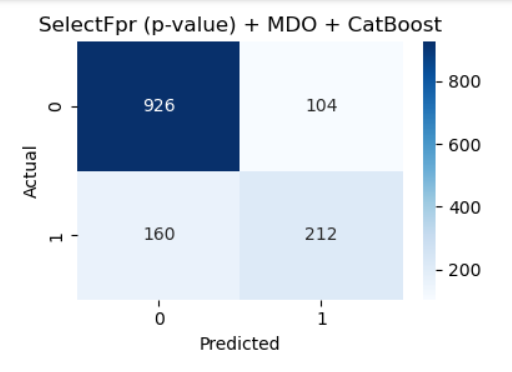

The top pipeline correctly identified **926 true negatives** and **212 true positives**, with 104 false positives and 160 false negatives — a solid balance for a dataset where the positive (churn) class is the minority.

### Best by Other Metrics (Tuned Results)

| Metric | Selector | Oversampler | Classifier | Score |
|---|---|---|---|---|
| Best Precision | SelectFdr (FDR) | MDO | Random Forest | 0.6844 |
| Best Recall | SelectKBest (F-value) | polynom_fit_SMOTE_star | Naive Bayes | 0.9182 |
| Best F1 | SelectFdr (FDR) | SMOTETomek | AdaBoost | 0.6358 |
| **Worst Accuracy** | SelectFpr (p-value) | V_SYNTH | Logistic Regression | 0.5275 |

Naive Bayes achieved very high recall (catching 92% of churners) but at the cost of precision (0.38) — useful if the business goal is "never miss a churner," even at the cost of more false alarms.

### Average Accuracy per Classifier

Ensemble methods clearly outperformed simpler models across the board:

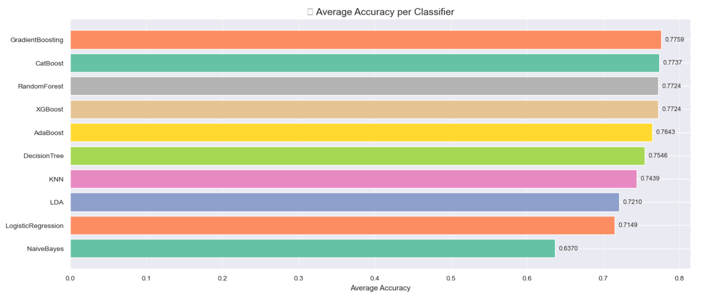

### Best Classifier per Feature Selection Method

CatBoost was the dominant classifier across nearly every feature selector, peaking at 0.8091 with SelectFpr:

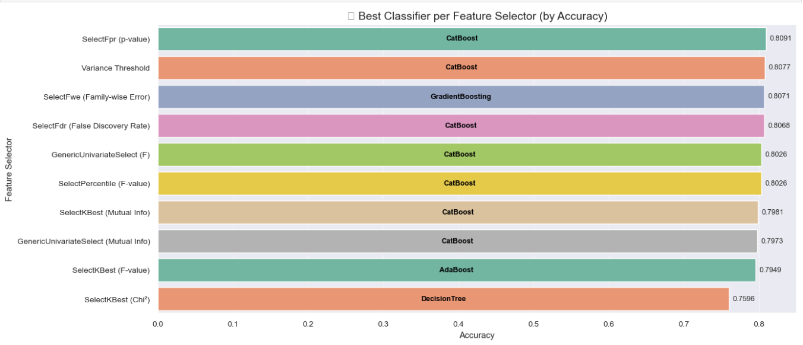

### Best Classifier per Oversampling Method

MDO, V_SYNTH, and polynom_fit_SMOTE_star — all paired with CatBoost — led the oversampler rankings:

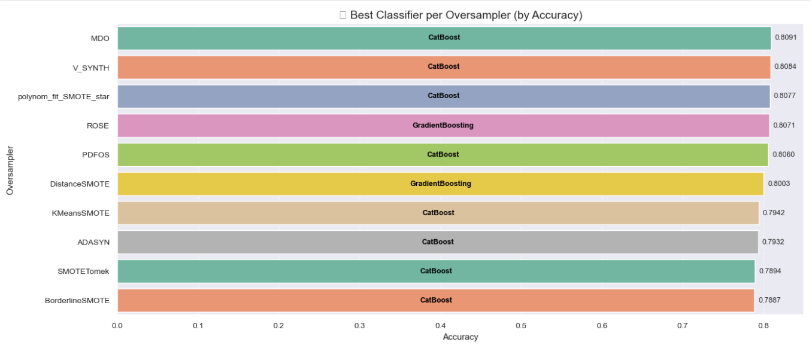

### Accuracy Heatmap — Oversampler × Classifier

A full view of cross-validated mean accuracy across every oversampler/classifier pairing. Naive Bayes (dark column) consistently underperformed regardless of oversampler, while MDO, ROSE, PDFOS, V_SYNTH, and polynom_fit_SMOTE_star produced the strongest scores across most classifiers:

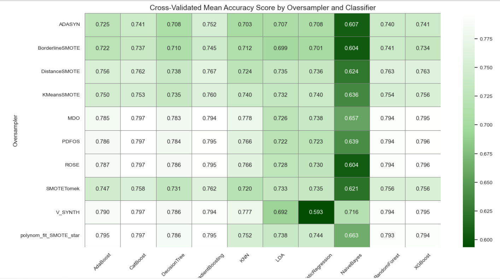

---

## Key Findings

- **No single component wins alone.** Feature selection, oversampling, and classifier choice interact — the best pipeline emerged only from testing the full combinatorial space.
- **CatBoost was the most consistently strong classifier**, topping the rankings for 7 of 10 feature selectors and 7 of 10 oversamplers.
- **Statistical filter-based selectors (SelectFpr, SelectFdr, SelectFwe, Variance Threshold) outperformed SelectKBest variants**, particularly SelectKBest with Chi², which lagged noticeably (best accuracy only 0.7596).
- **Domain-aware synthetic oversamplers (MDO, V_SYNTH, polynom_fit_SMOTE_star, ROSE, PDFOS) outperformed classical SMOTE variants** (BorderlineSMOTE, ADASYN, SMOTETomek) for most classifiers.
- **Hyperparameter tuning shifted the winning combination**: before tuning, the best pipeline used GradientBoosting (0.8068); after tuning, CatBoost edged ahead (0.8091).
- **Naive Bayes and Logistic Regression consistently underperformed** ensemble and tree-based methods, particularly when paired with synthetic oversampling that introduces non-linear class boundaries.

---

## Tech Stack

`Python` · `scikit-learn` · `imbalanced-learn` · `smote-variants` · `CatBoost` · `XGBoost` · `pandas` · `NumPy` · `matplotlib` · `seaborn`

---

## Repository Structure

```
customer-churn-prediction/
├── README.md
├── data/
│   └── WA_Fn-UseC_-Telco-Customer-Churn.csv
├── notebooks/
│   └── customer_churn_fs_os_pipeline.ipynb
├── report/
│   └── Customer_Churn_Prediction_Report.pdf
└── images/
    ├── churn_distribution.png
    ├── contract_vs_churn.png
    ├── tenure_vs_churn.png
    ├── payment_method_vs_churn.png
    ├── gender_vs_churn.png
    ├── dependents_vs_churn.png
    ├── best_pipeline_confusion_matrix.png
    ├── avg_accuracy_per_classifier.png
    ├── best_classifier_per_selector.png
    ├── best_classifier_per_oversampler.png
    └── accuracy_heatmap_oversampler_classifier.png
```

---

## Future Work

- Extend GridSearchCV tuning to all 1,000 combinations rather than the top-N (compute permitting)
- Add SHAP-based feature importance for the winning pipeline to support business-facing interpretability
- Deploy the best pipeline (SelectFpr + MDO + CatBoost) as a scoring API for real-time churn risk flags
